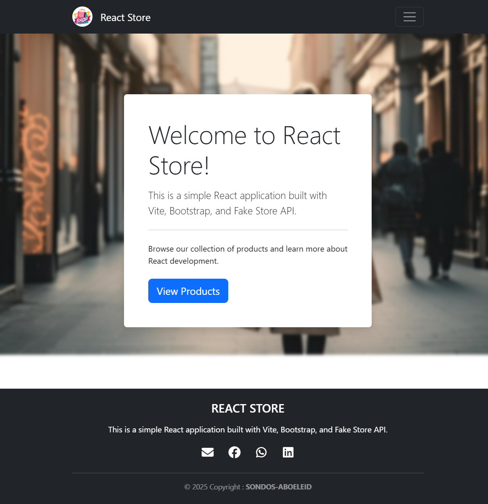
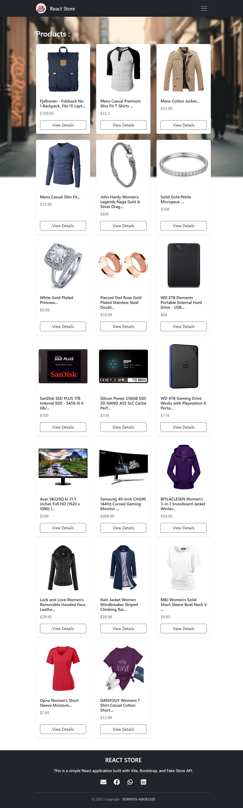

# 🛍️ React Store

## Overview
React Store is a modern e-commerce web application built with React. It provides a clean, responsive interface for browsing products from the Fake Store API. The application demonstrates best practices in React development, including component structure, routing, and API integration.

## Features
- **Responsive Design**: Fully responsive layout that works on mobile, tablet, and desktop devices
- **Product Catalog**: Browse through a collection of products with image previews
- **Product Details**: View detailed information about each product
- **Modern UI**: Clean and intuitive user interface built with Bootstrap
- **Fast Loading**: Optimized performance with Vite build tool
- **Data fetching using Axios**
- **Fixed and styled background**

## Technologies Used

### Frontend
- **React 19**: Latest version of the popular JavaScript library for building user interfaces
- **React Router 7**: For handling navigation and routing within the application
- **Bootstrap 5**: For responsive design and pre-styled components
- **Axios**: For making HTTP requests to the API

### Development Tools
- **Vite**: Next generation frontend tooling for faster development and optimized builds
- **npm**: Package manager for JavaScript

### API
- **Fake Store API**: RESTful API that provides product data for e-commerce websites
- [Fake Store API](https://fakestoreapi.com/)

## Getting Started

### Prerequisites
- Node.js (v16 or higher)
- npm (v7 or higher)

### Installation

1. Clone the repository
```bash
git clone https://github.com/username/repo-name.git
cd react-store
```

2. Install dependencies
```bash
npm install
```

3. Start the development server
```bash
npm run dev
```

4. Open your browser and navigate to `http://localhost:5175`

### Building for Production

```bash
npm run build
```

The build artifacts will be stored in the `dist/` directory.

## Project Structure
├── public/              # Public assets
├── src/                 # Source files
│   ├── assets/          # Static assets
│   ├── components/      # Reusable components
|   |    ├──Details      # Details.jsx
|   |    ├──Footer       # Footer.jsx       
|   |    ├──Home         # Home.jsx
|   |    ├──Img          # Img.jsx
|   |    ├──Layout       # Layout.jsx
|   |    ├──Navbar       # Navbar.jsx
|   |    ├──Notfound     # Notfound.jsx
|   |    └──Products     # Products.jsx
│   ├── App.jsx          # Main application component
│   ├── App.css          # Application styles
│   ├── index.css        # Global styles
│   └── main.jsx         # Entry point
├── .gitignore           # Git ignore file
├── eslint.config.js     # ESLint configuration
├── index.html           # HTML template
├── package.json         # Project dependencies and scripts
├── README.md            # Project documentation
└── vite.config.js       # Vite configuration


## Acknowledgements
- [Fake Store API](https://fakestoreapi.com/) for providing the product data
- [React](https://reactjs.org/) for the amazing library
- [Vite](https://vitejs.dev/) for the blazing fast build tool
- [Bootstrap](https://getbootstrap.com/) for the responsive design framework


## Screenshots



.png)

## Copyright
- All rights reserved to Sondos Aboueleid © 2025